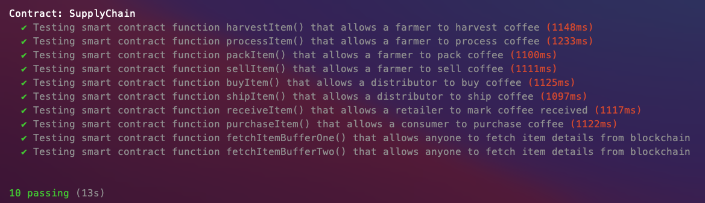

# Supply chain & data auditing

## UML documents
PDF available [here](./docs/images/Udacity_Supplychain_testing.png)

## Versions and Libraries
- node : 14.19.0
- Truffle: 5.5.13
- Solidity: ^0.8.1
- @truffle/hdwallet-provider: 6.14.16 (used for deploying to rospten to provide wallet mnemonics)

## Unit test and transaction history checks

## Transaction ID and contract address
- transaction ID:0x5f06d76812e6f22e221e12ffef0b131f00415e2deeb7ad7a031c2a05f332fbbc
- Contract address: 0xa226755C5ea09c3f7b4984ce2353D3e7C5aB34B0
(https://ropsten.etherscan.io/address/0xa226755c5ea09c3f7b4984ce2353d3e7c5ab34b0)

## Additional notes
1. The unit tests had to be adadpted to the newer versions of Solidity
2. The contract was deployed to the testnet Ropsten as I had some issues with Rinkeby (probably linked to an old version of Truffle)
3. Used secrets.json file to setup Infura project ID and account mnemonics.
To run on your machine, rename the file secrets-template.json to secrets.json and change the variables with your own.
